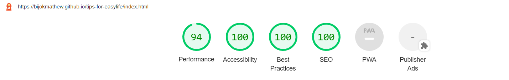

# Easy Life Tips<!-- omit in toc -->

# The purpose with this project<!-- omit in toc -->

This website (Easy Life Tips) created to help people learn all sorts of different tips and tricks that can save them time and money in their everyday life. Also users can submit their own life hack ideas so that the website will become a living, up to date.

This website has three sections:

 1. Home
 2. Category
 3. Submit Hacks

### The business goals of the website are:<!-- omit in toc -->

* This website help the user to find the life hacks tips easily with the help of categories.
* As this website is user friendly so that user love to visit again for finding more life hack tips 
* Responsible to up to date the latest information in the website.
* Once visitor traffic is sufficient, sell advertising space.
* Partner with businesses who would help our users with 'sponsored' LifeHacks.

### The user goals of the website:<!-- omit in toc -->

* As a first time visitor  want to find out exactly what a Life Hack is.
* As a first time visitor I want to find out some new tips and tricks that can save me time and money.
* I want to share my Life Hacks with a community who will appreciate it via the website.
* As a repeat visitor I want to find the newest solutions to problems I might be having.

This website is the first of five projects that needs to be completed in order to receive a diploma in Software Development from The Code Institute.

Requirements for the project is that the website has to be static and responsive using HTML5 and CSS3.
# Table of Content <!-- omit in toc -->
- [UX](#ux)
  - [Strategy](#strategy)
  - [User Stories](#user-stories)
    - [Existing Members](#existing-members)
    - [New Users](#new-users)
  - [User Goals](#user-goals)
  - [Scope](#scope)
  - [Design](#design)
    - [Typography](#typography)
    - [Images](#images)
- [Features](#features)
  - [Existing Features](#existing-features)
    - [Header and Navigation Section](#header-and-navigation-section)
    - [Hero Image Section](#hero-image-section)
    - [About us Section](#about-us-section)
    - [Category Section](#category-section)
    - [Hack submission Section](#hack-submission-section)
    - [Footer Section](#footer-section)
    - [FormT-ack page](#formt-ack-page)
  - [Features Left to Implement](#features-left-to-implement)
- [Technologies used](#technologies-used)
- [UX Stories Testing](#ux-stories-testing)
  - [Bugs](#bugs)
  - [Validator Testing](#validator-testing)
- [Development and Deployment](#development-and-deployment)
- [Content](#content)
- [Media](#media)
- [Credits](#credits)
  - [For code inspiration, design inputs, help and advice. Many thanks to:](#for-code-inspiration-design-inputs-help-and-advice-many-thanks-to)
  - [Great sources](#great-sources)
     
## UX

### Strategy

This website is ment for:

 - Who is looking to make their life easier 
 - Looking to save time and energy
 - looking to save money
 - The people who are passionate to explore new ideas 

What user looking for?
 - Easy to use
 - Easy to search life hack tips based on the topics
 - Wide range of categories and life hack ideas.
 - Content has to be up to date
 - User also want to share their life hacks

  Based on all the above requirements, built the website in such a way that 
    - User can easily to navigate in to different topics
    - Presentation of the website is very simple
    - Provides an option for user to contributes their ideas

### User Stories

#### Existing Members

 - As a Member: I want to search the topic easily.
 - As a Member: I want to submit my ideas.
 - As a Member: I want to explore new tips.

#### New Users

 - As a new User: I want to know what is life hack.
 - As a new User: I want to search specific topic.
 - As a new User: I want to get alert using social medias .

### User Goals

 - Easy to navigate and search tips
 - Submit users life hack ideas 
 - Visit our social networks
 - Explore the new life hacks

### Scope

As per business goals and user's needs, the below features included in the first release:
1. Clear Header with website logo and navigation bar linking to various sections of the website.
   Quick idea for the user on what a life hack is.
2. A submission form so users can submit forms that can later be added to the website.
   A footer with links to social media pages.
3. Included three categories like Techenology,Health and Money Savers.
4. Footer contains links to social media pages.

### Design

 Tips For Easy Life project's design has been influenced by the ”Love Running” and "Coders Coffeehouse" - projects.
 My design of the header and hero-header has also been influenced by those projects.

 Main aim is to create a clean looking website where there is a balance between colors, images and functionality.

 Tips For Esay Life website is a single page website divided in to three sections. Menu is fixed on top in order to ensure easy navigation between the sections.
 
#### Typography

The [Google Font Open Sans]('https://fonts.googleapis.com/css2?family=Open+Sans&family=Sansita&display=swap')was chosen as the main font with a fallback of Sans-Serif. Font weights of 300, 500 and 700 has been used on the website.

#### Images

Images has been chosen in accordance to colour and content. The purpose of the website is to give a friendly look and express quality. Images has been sized in order to match design.

[Back to top](#Easy-Life-Tips)

## Features 

Tips For Easy Life website is a single page website that consists of these sections:

 - Header (Logo/Menu)
 - Hero Image with descripyion of life hack
 - About Us
 - Categories
 - Hack submission form
 - Footer with links to social medias

In order to make navigation easier between the sections the navigation bar is fixed on top when the user scrolls thru the page.

### Existing Features

#### Header and Navigation Section

  - The Header consists of a Logo section, text-based, that is aligned to the left and a Menu that is aligned to the right.

#### Hero Image Section

  - The Hero image section contains a Hero Image, header and a paragraph.
  - The section also contains a header and a paragraph that gives the user a clear message on what this website is about.

#### About us Section

  - The about us sections contains paragraph and an image. One informative part with a longer paragraph next to an image.  
  - The purpose of the About Us section is to give Users a feel of what is life hack and what kind of life hacks user 
    can search in the website. The images gives a comforting feel.

About Us - Image

[Back to top](#Easy-Life-Tips)

#### Category Section

  - This section contains a header and three sub categories.
  - The purpose of this section is to give the User can easily search life hacks in different categories.

#### Hack submission Section

  - The section contains a contact form with text area where user can submit their life hacks. 
  - The purpose of this section is to allow user to contributes their hack tips in to the website.

#### Footer Section

  - The Footer contains four social media links (Facebook, Twitter, YouTube and Instagram) The code for the Footer is borrowed    from the Love Running - Project.
  - The purpose of the Footer is to provide easy access for the User to the different social media platforms were Tips For Easy Life has a presence.

#### FormT-ack page

  - This site contains a message when the user submit their hack.
  - The purpose of this page to give an acknowledgement to the user .

### Features Left to Implement

- Later versions of this projects will include more categories .
- In future versions
    - Category section design will change in order to include more life hacks in different categories.
    - Give an option to the user to filter the life hacks based on the update, popular etc.
    - Give a search option so that user can easily search any specific hack tips, 

[Back to top](#Easy-Life-Tips)

## Technologies used

- [HTML](https://en.wikipedia.org/wiki/HTML)
- [CSS](https://en.wikipedia.org/wiki/CSS)
- Font Awesome - Used to provide in the Hacks section and also in the Footer.
- Chrome Dev Tools - Used to check my work periodically, debug my code when needed and also test the responsiveness of my website.
- GitHub - Used to store my code after pushing from Gitpod.
- GitPod - Used as a development environment.
- Git - Used for version control of my code.
- Sketch - Used to create the wireframes for the project.
- Google Fonts - Used to style my website fonts.
- W3C Markup Validation Service - Used to validate all of my HTML code.
- W3C CSS Validation Service - Used to validate all of my CSS code.
- Color Contrast Accessibility Validator - Used to check my website colours had enough contrast for accessibility purposes.
- Optimizilla Image Compressor - Used to compress the images.
- Dirty Markup Formatter - Used to standardise and format my HTML and CSS code.

## UX Stories Testing 

Below are website images for reference with the UX Stories Testing.

1. As a new visitor, I want to browse all the information available to see.

    - The user can navigate to the 'Category' section of the page.
    - The user can see all of the available categories of Life Hack on the website.

2. As a new user, I want to know what life hacks are.

    - The user can navigate to website.
    - On the landing page as well 'About us' section has a description of what a Life Hack is and the scope of them.

3. As a repeat visitor, I want to see what content is new.

    - The user can navigate to the 'Category' section of the page.
    - The user can scroll over all relvant categories to check the information inside.
    - In the future I would like to add an option to sort the hacks by update date, popularity and other criteria.

4. As a repeat visitor, I want to submit a hack I have.

    - The user can navigate to the 'Submit Hack' section of the page.
    - The user can select the category of his hack and fill out the form to enter all of their information.
    - The form will prompt the user if any fields are left blank or are formatted incorrectly.
    - After submition user will get an acknowledgement
   
5. As a user, the website should work for samll screen devises also
   - All the layout and images in the website are clearly visible to the user    
   - Depends on the screen diamensions, website layout design of category, about sections will change
  
[Back to top](#Easy-Life-Tips)

### Bugs 

During the development stage, found many minor and major issues .The following bugs took time to resolve.

1. During Responsive test case, form page and text area are not fit in to the smaller screen devices and it is very hard to set the width for form and text-area eaxactly without affecting the look for smaller device.
  - Solution:  Calculated the large screen  device width and calculated the width of form and text area in % so that no need to give seperate value for smaller devices    

2. Top menu disappears even though its fixed.
 - Solution: Used z-index to keep the navigation menu on top of all sections and elements, value set to 20
 
### Validator Testing 

At each stage of the wesite development various types testing was executed to find the issues by using using Chrom Dev Tools.
After the completed version of the website, used three forms of validations to verify the code stability. Also carried out the responsive test for different screen resolution by using chrome tool. 

- HTML
  - No errors were returned when passing through the official [W3C Validator](https://validator.w3.org/nu/?doc=https%3A%2F%2Fbijokmathew.github.io%2Ftips-for-easylife%2F)

- CSS
  - No errors were returned when passing through the official [(Jigsaw validator)](https://jigsaw.w3.org/css-validator/validator?uri=https%3A%2F%2Fbijokmathew.github.io%2Ftips-for-easylife%2F&profile=css3svg&usermedium=all&warning=1&vextwarning=&lang=en)

- Lighthouse testing

[Back to top](#Easy-Life-Tips)

## Development and Deployment

The development environment used for this project is GitPod and also used github version control tool to stote the project.Github help to keep track each version and easily track the changes made to the source code. The GitPod environment was created using a template provided by Code Institute.

The live version of the project is deployed at GitHub pages.

The procedure for deployment followed the "Creating your site" steps provided in [GitHub Docs.](https://docs.github.com/en/pages/getting-started-with-github-pages/creating-a-github-pages-site)

1. Log into GitHub.
2. Go to the GitHub Repository of project(tips-for-easylife) which shall be deployed live.
3. At the top of the repository, select Settings from the menu items.
4. Scroll down the Settings page and select pages->GitHub pages
5. At the ”Source” section choose ”main” as Branch and root as folder and click ”Save”
6. The website will deploy and the pages refreshes to provide the live link to the project.

The live link can be found here - https://bijokmathew.github.io/tips-for-easylife/

## Content 

All content for the website taken from  Google and an lifehack app 'Life Hack Tips - Daily Tips for your Life'

## Media

- All Icons used are from FontAwesome (https://fontawesome.com/)

- All images used in the website were found on Pexels.com and shutterstock.com 

## Credits 

### For code inspiration, design inputs, help and advice. Many thanks to:

Martina Terlevic
 - My mentor at Code Institute and she guided me throught the project.
 - Friends and Teachers at Code Institute: Thank you for all your knowledge and insight.
 - Walkthrough project ”Love Running” has provided  inspiration and knowledge.

### Great sources

Sites that has provided me with knowledge and information that has been vital to this project:

- https://www.w3schools.com/
- https://stackoverflow.com
- https://learn.codeinstitute.net/dashboard 
- https://www.youtube.com
     

Top screenshot in this ReadMe was made using:

http://ami.responsivedesign.is/

Best regards

[Back to top](#Easy-Life-Tips)

